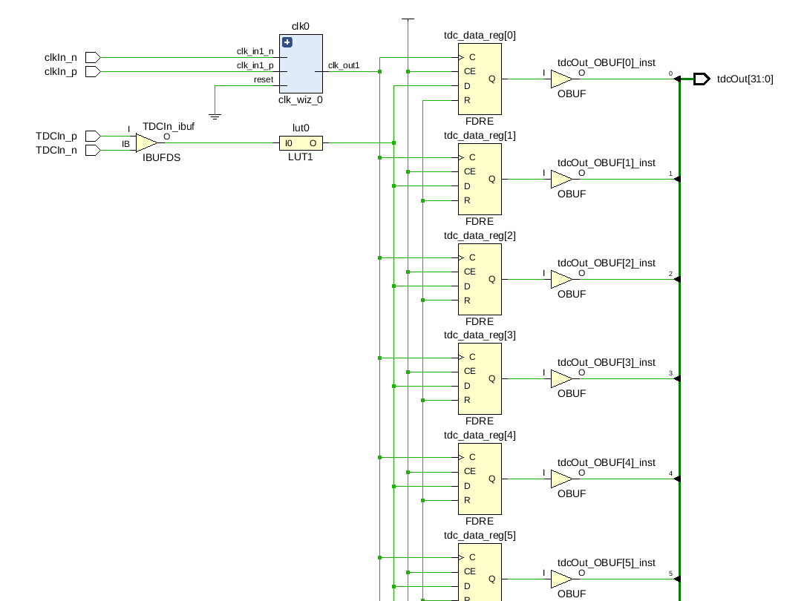
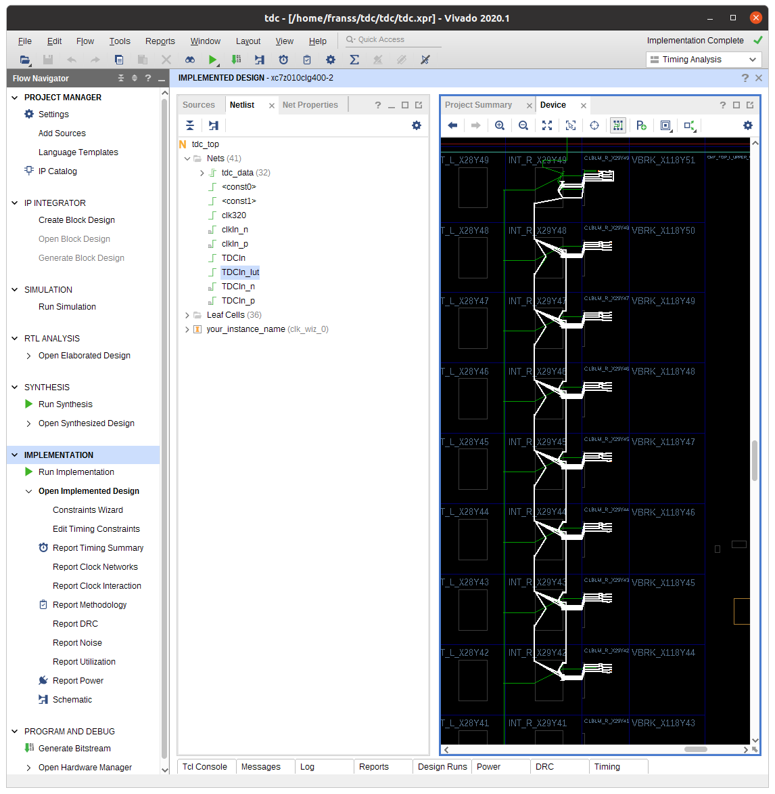
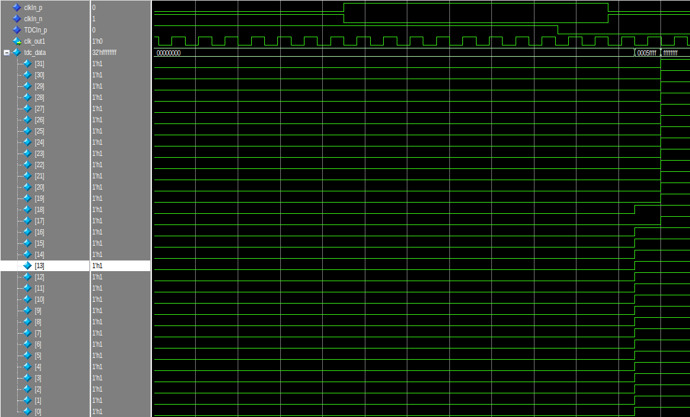

# delay_line_tdc
This is a time to digital converter idea, using a delay line. The delay line is purely made out of routing, 
a bunch of registers are placed close to each other, and their D inputs are all connected to the same net, see the following schematic.

The constraints make sure that the flipflops and are placed on a certain position, and the route is fixed. 
This will probably have to be redone if any other device is used. This example was created for a Xilinx xc7z010 FPGA, but any Xilinx device should work in a similar way. If you write your own constraints, any other vendor device should also work.

The routing should look something like this in the Vivado device view:

When there is a transition, some of the bits flip, depending on where the pulse arrived first. The bits are not perfectly ordered in terms of routing delay, calibration has to be performed.

Some logic interpreting the different waveforms and translating it into an actual timestamp have to be performed as well.
